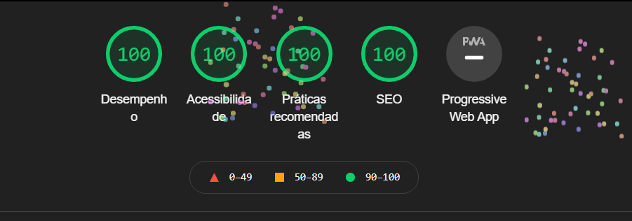
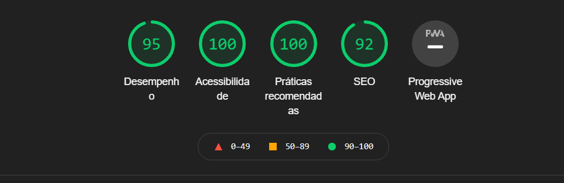

# Frontend 

### Desafio

Implementar apenas a parte visual do topo de uma loja virtual, seguindo o modelo de layout proposto.

Para iniciar você pode editar o aquivo `index.html`, aplicando o código html e utilizando recursos (javascript, css e etc) de acordo com a necessidade. O topo possui um efeito hover (dropdown) no item "Entrar".

### Como realizar

Faça o fork do repositório, realize os seus commits e ao final envie o link do seu repositório para o e-mail rh@moovin.com.br. Este repositório já possui uma base para iniciar o desenvolvimento, utilize-a como achar necessário. 

### Layout

https://xd.adobe.com/spec/a069b4c3-7313-4cda-40a8-2f8252766519-d658/

### Dúvidas

Em caso de dúvida entre em contato pelo skype **matheusmoovin**

---

<h1 align="center">
   Desafio Front-End
</h1>
<h1  align="center"> Concluido</h1>

<h4 align="center"> 
	 Moovin
</h4>

  
  
  
    
  
   

## :warning: Sobre o projeto

Projeto desenvolvido para o desafio proposto pela empresa [Moovin](https://www.moovin.com.br/) para vaga de desenvolvedor Front-End 

---

##  :mag_right: Lighthouse
Projeto realizado sob as melhores práticas de desenvolvimento. Testado e aprovado nos seguintes pontos de análise da ferramenta Lightouse
- Acessibilidade
- Desempenho 
- SEO
- Práticas recomendadas

### :computer: Desktop

  

###  :iphone: Mobile

  

---
##  :star:Autor

 ### <b>Fernando Aquistapace</b></a> 
---

